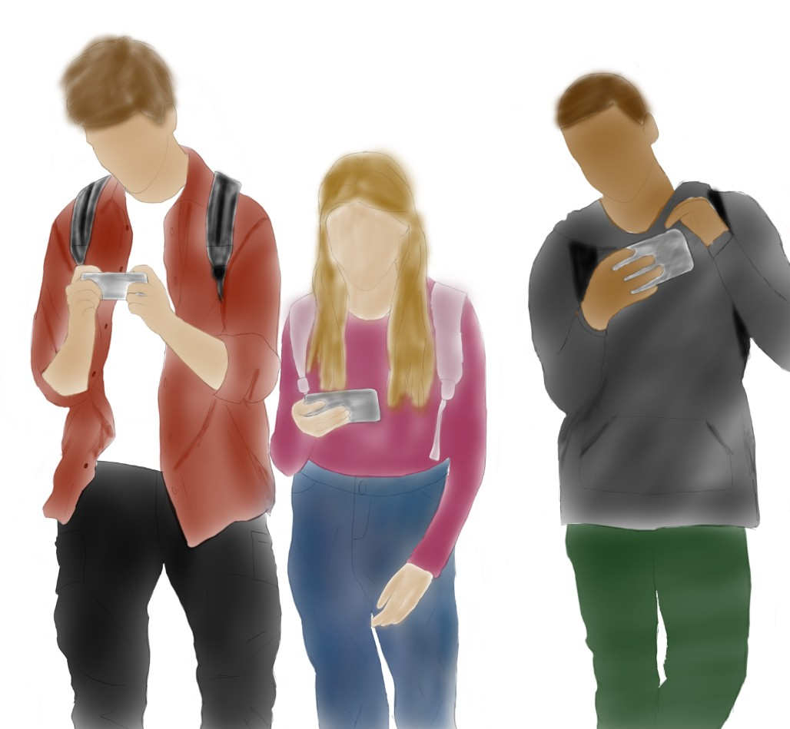

# CIS-1250 
<html>

<head>
  <meta name="google" content="notranslate">
</head>

<body>
  <h1>CIS 1250 Writting Assignment 1</h1>
  
An example of software that I personally use, and think is well designed, is the game Hayday. This is a mobile game which simulates a farmer’s experience. I believe this software was designed well because of its commitment to user-friendly interface. Firstly, software design is important since its functionality impacts the user’s experience. This can be seen in Hayday since it is a software that resonates with all audiences is as the game is not difficult to understand or play. This makes the game is user-friendly and allows for the easy navigation of the game. The game is focused on experience of players who play the game. This is evident as the game does not force any teaching on how to play the game, meaning the user is able to determine how they want to play. Another element of the game which encourages users is the level system. Players will earn XP points by completing and preforming. By gaining points, players level up, and unlock new features, which keeps the gameplay exciting. Secondly, updates are critical while designing software. Bug fixes, user experience, adaptations, are all important in maintain the quality of a software. Part of the software design process is maintaining the application, because of technology continuously evolving, applications need to be updated and reviewed regularly. Though Hayday not being a new game, the software updates and user experiences keep it fresh and intriguing. As a result of its excellent software design, Hayday has withstood the test of time, with its original release being 12 years ago. This remains a popular mobile game which is still enjoyed by audiences today. 

</body>

<body>
  <h1>CIS 1250 Writting Assignment 2</h1>
  
1.	In the requirements gathering stage, developers are expected to figure out what problem they are solving, and who will be using the product they are creating. To solve these questions, developers must talk to customers by asking questions and communicating ideas to curate a clear and concise description of what the client needs. In software, requirements are a set of operations that the program must preform. This is an important stage in the software development process as it helps the developer understand the problem the product will be solving and what the users should gain/be able to do with the product. Additionally, it is the foundation for the following stages of the software development process since it acts as a guide for the development. “Good” requirements, are essential for the proper development of software. “Good” requirements must be clear, concise, measurable, and testable. Also, by creating a document of good requirements, developers prevent misunderstandings and disagreements about expectations.

  
2.	User stories:

  
As a user, I want a way to track my crops, so that I know if I have enough to produce different items like animal feed, bread, etc.

  
As a user, I want a shop for my farm, so that I am able to sell items and crops for money.

  
As a user, I want a way to connect with people, so that we can share items/crops and help each other. 

</body>

<body>
  <h1>CIS 1250 Writting Assignment 3</h1>
  
Software product for Writting Assignment 1: HayDay

  <h2>Sam</h2>
  

  “HayDay is a great way for my friends and I to connect. I enjoy expanding my farm and try to stay ahead of my friends! This game is also like my own world! – I like being able to go into it and forget about real life challenges. ”   
  <b>AGE:</b> 17 
  <b>OCCUPATION:</b> High School Student 
  <b>LOCATION:</b> Caledonia, Ontario, Canada  
  <h3>Dimensions:</h3> 
      - He loves <b><i>connecting</i></b> with friends 
      - He enjoys <b><i>mobile gamming</i></b> 
      - He is a <b><i>quick learner</i></b> 
      - He likes to <b><i>escape</i></b> the real world  
  <h3>Motivations:</h3> 
      - <b>His Relationships.</b> While playing the game, Sam is able to connect with his friends and build new relationships through game play.  
      - <b>Creativity.</b> Sam is motivated by the options to customize his farm. He see this as a way to express his styles and loves to see his friends different layouts.  
      - <b>Competition.</b> Sam enjoys the achievements of HayDay. The competition between him and his friends leveling up is one of the reasons he continues to play the game.  

  
  
  <h2> A picture of Sam playing HayDay with his friends. </h2>
</body>

</html>
